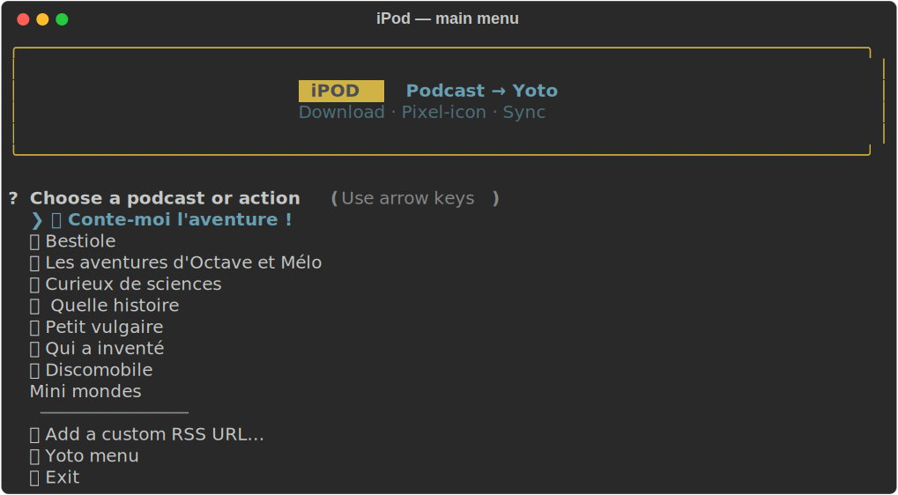
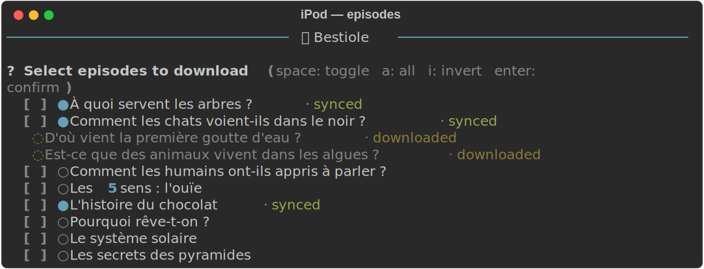
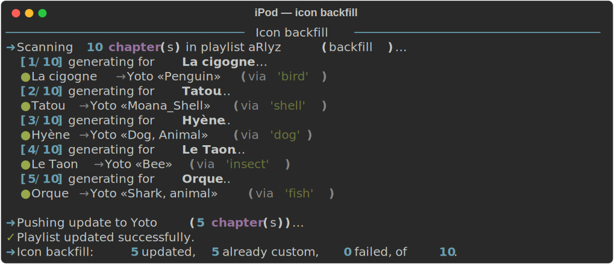

# iPod — Podcast → Yoto

A terminal app that downloads kids-podcast episodes from RSS, trims ads, and
syncs them to your [Yoto player](https://yotoplay.com) as MYO card playlists —
with auto-generated per-episode pixel icons.

<p align="center">
  
</p>

<p align="center">
  
</p>

<p align="center">
  
</p>

## What it does

1. Picks an RSS feed (built-in presets or custom URL).
2. Detects which episodes are already on your Yoto card and which are only
   downloaded locally (distinct status dots).
3. Downloads selected episodes, cuts the ad intro via pydub silence detection,
   and uploads the clean MP3 to Yoto.
4. Waits for Yoto's transcoding step with exponential-backoff polling so a
   slow transcode never blocks the pipeline.
5. Generates a per-episode 16×16 pixel icon — derived from the episode title —
   and attaches it to the chapter + track on the Yoto card.

Everything is driven by arrow keys, space (multi-select), and enter.

## Features

- **Dynamic TUI** — arrow/space/enter navigation, styled via
  [`questionary`](https://github.com/tmbo/questionary) and
  [`rich`](https://github.com/Textualize/rich).
- **Per-preset action menu** — ⚡ Quick sync / Browse episodes / Generate icons / Back.
- **Quick sync** — one-click shortcut that picks every feed entry not yet on
  your Yoto card, confirms the count, and runs the full download + upload
  pipeline.
- **Status-aware episode list** — one scrollable checkbox list with inline
  status dots: `●` synced on Yoto, `◌` downloaded locally but not synced,
  `○` not downloaded yet.
- **Ad trim** — detects the first long silence in the first 5 minutes and
  trims everything before it.
- **Resilient upload** — distinguishes "downloaded locally" from "actually
  synced on Yoto", so a prior transcoding failure doesn't force a re-download.
- **Exponential-backoff transcode polling** — 2s, 4s, 8s … capped at 60s over
  up to 10 attempts.
- **Automatic pixel icons** — three-tier chain: Yoto's native ~530-icon pixel
  library first, then a Creative-Commons PNG from Openverse pixel-quantized,
  then Iconify colored emoji. Licensed-character icons (BrainBots, Thomas &
  Friends, Disney, Peppa Pig, …) are de-ranked.
- **Ollama-powered keyword extraction** — when a local Ollama is available,
  it returns 5 ranked English synonyms per (often French) episode title for
  better matches against the Yoto icon library. Gracefully falls back to a
  bundled French→English dictionary if Ollama is offline.
- **Per-podcast icon cache** — `downloads/<podcast>/.icon_cache.json` so the
  same episode doesn't re-generate its icon.
- **Icon backfill** — regenerate icons for chapters already on your card;
  optional force mode overwrites existing custom icons.

## Getting started

### Requirements

- Python 3.10+
- [FFmpeg](https://ffmpeg.org/) (required by `pydub` for silence detection).
  macOS: `brew install ffmpeg`.
- One of `cairosvg`, `rsvg-convert`, ImageMagick, or macOS `sips` for the
  Iconify SVG→PNG fallback tier (optional — the other tiers don't need it).
- [Ollama](https://ollama.com) with a chat model pulled (defaults to
  `llama3.1:latest`). Optional but highly recommended.
- A [Yoto developer](https://dashboard.yoto.dev/) Public Client ID.

### Install

```bash
git clone git@github.com:jaudoux/ipod.git
cd ipod
python3 -m venv .venv
source .venv/bin/activate
pip install -r requirements.txt
```

### First run

```bash
python3 ipod.py
```

- On first use you'll be asked for your Yoto Client ID — paste the one from
  [dashboard.yoto.dev](https://dashboard.yoto.dev/). The app then runs the
  Yoto OAuth device flow in your browser; the code is saved to
  `yoto_tokens.json` for subsequent runs.
- Pick a preset from the main menu to start. If it's linked to a Yoto card,
  pick **Browse & download episodes**, tick the episodes you want with
  `<space>`, and press `<enter>`.
- To regenerate icons for an existing card, pick **Generate icons** instead.

## How icons are picked

For each episode title, the matcher walks three sources in order and stops at
the first hit:

1. **Yoto native library** — asks Ollama for 5 keyword synonyms, scores every
   public Yoto icon against them (tag match = 30, title-word match = 20;
   boosts the `px`-tagged native pixel set; penalizes licensed-character
   icons). No upload step — the match is referenced directly by `mediaId`.
2. **Openverse (CC-licensed image)** — downloads the top PNG result, center-
   crops, Lanczos-downsamples, nearest-neighbor to 16×16, 16-color-quantizes,
   and uploads as a custom Yoto icon.
3. **Iconify colored emoji** — Noto / Twemoji / Fluent-Emoji / Flat-Color-Icons
   SVG rendered to 16×16 PNG and uploaded.

If all three fail, the chapter keeps Yoto's default star icon. Generated icon
references are cached per podcast so the next run is free.

## Configuration

Environment variables (all optional):

| Variable | Default | Purpose |
|---|---|---|
| `OLLAMA_URL` | `http://localhost:11434/api/generate` | Ollama endpoint. |
| `OLLAMA_MODEL` | `llama3.1:latest` | Model name used for keyword extraction. |
| `OLLAMA_TIMEOUT` | `15` | Seconds before the Ollama request gives up. |

Local files (all gitignored):

- `yoto_config.json` — your Yoto client ID.
- `yoto_tokens.json` — OAuth access + refresh tokens.
- `yoto_public_icons.json` — cached Yoto icon library (~190 KB).
- `downloads/` — audio files and per-podcast icon cache.

## Project layout

```
ipod.py          # top-level menu, episode browser, download/upload orchestration
yoto_api.py      # OAuth device flow, content/media/icon endpoints, yoto_menu
icon_factory.py  # keyword extraction, icon matching, backfill
tui.py           # shared questionary + rich primitives
requirements.txt # questionary, rich, feedparser, pydub, requests, pillow, tqdm, termcolor
```

## Known limitations

- The Iconify fallback needs an SVG→PNG renderer on `PATH`.
- Ollama keyword extraction is non-deterministic; temperature is kept low
  (0.3) but unusual French titles can still confuse it — the bundled
  French→English dictionary and the raw tokens are tried as backups.
- Some Yoto icons are licensed content (BrainBots, Thomas & Friends, Disney,
  Peppa Pig, …). The matcher penalizes those heavily but they can still be
  picked when nothing else matches.

## Acknowledgements

- [Yoto](https://yotoplay.com) for the Developer API.
- [Iconify](https://iconify.design/) and
  [Openverse](https://openverse.org/) for the image sources.
- [questionary](https://github.com/tmbo/questionary) and
  [rich](https://github.com/Textualize/rich) for the TUI foundation.

## License

MIT — see [LICENSE](LICENSE).
