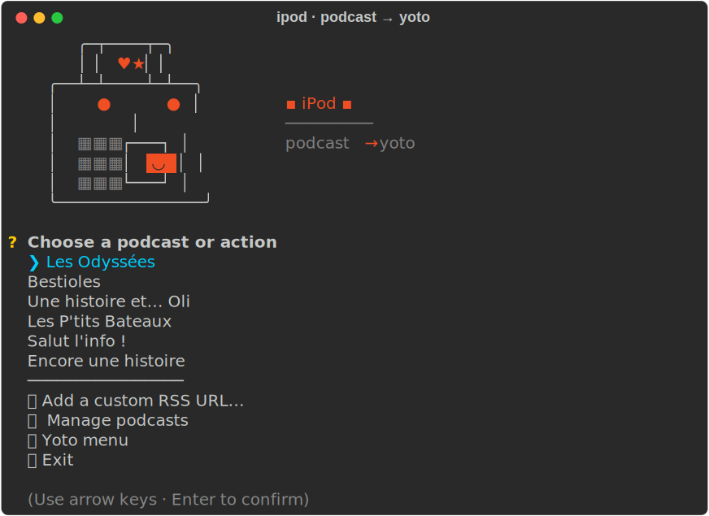

# iPod — Podcast → Yoto

A tiny terminal app that turns any kids-podcast RSS feed into a
[Yoto](https://yotoplay.com) MYO card — ads trimmed, pixel icons generated,
episodes ordered newest-first.

<p align="center">
  
</p>

## What you get

- 🎧 **Pick a feed** — curated French starter list (Les Odyssées, Bestioles,
  Oli, Les P'tits Bateaux, Salut l'info !, Encore une histoire) or your own RSS.
- ✂️ **Ad-free audio** — auto-detects the first long silence and trims the
  intro ad.
- 🖼️ **Pixel icon per episode** — matches against Yoto's native library first,
  then Openverse (CC images), then Iconify emoji. No hand-picking.
- 🔀 **Newest on top** — new episodes are prepended to the card; a one-shot
  reorder action fixes legacy cards.
- ⚡ **Quick sync** — one keystroke downloads + uploads every episode not
  already on the card.
- 🟢 **Status dots** — `●` synced, `◌` downloaded, `○` not yet fetched. No
  re-downloading.

## Install

```bash
curl -fsSL https://raw.githubusercontent.com/jaudoux/ipod/main/install.sh | bash
```

Then `ipod`. On first run, paste your [Yoto developer](https://dashboard.yoto.dev/)
Client ID — the app handles OAuth in your browser.

Needs Python 3.10+, FFmpeg (`brew install ffmpeg`), and optionally
[Ollama](https://ollama.com) for smarter icon matching on French titles.

## License

MIT — see [LICENSE](LICENSE).
